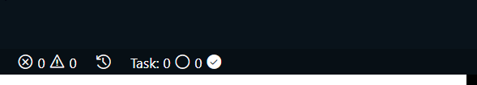
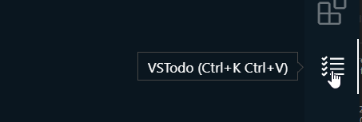

# Change Log
<!-- 
All notable changes to the "vs-todo" extension will be documented in this file.

Check [Keep a Changelog](http://keepachangelog.com/) for recommendations on how to structure this file. -->

## [0.0.1]

Initial release of VS todo

## [0.0.3]

minor bug fix.

## [1.0.0]

Added shortcut key bindings.

### [1.1.0]

Added shortcut to input pop up.

### [1.2.0]

Added Category based task grouping.

### [2.0.0] - 22 July 2021

## Added
* Single task on multiple category
* Filter: Multiple filter present for better productivity

* task now contain category name in cyan color and creation time in red color for better management.

* completed and incomplete task on the status bar left side

* Keybindings to open panel: <kbd>Ctrl + k, ctrl + v</kbd> for windows and <kbd>cmd + k cmd + v</kbd> for mac.

* No more accidental delete.

## Changed
* Look : The UI is completely changed now more minimal but also detailing look.
## fixed
* No Task add until the panel open first time.
