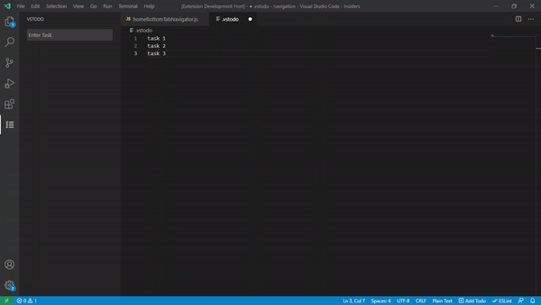

# VS Todo
### Track your remaining task and be more productive.

## Features

- &#9745; Easy to add via activity bar or by just typing
- &#9745; just select a text and press <kbd>Ctrl</kbd> + <kbd>Alt</kbd> + <kbd>a</kbd> or <kbd>shift+cmd+a</kbd> to add to todo list.
- &#9745; shortcut key for auto input field pop up (press <kbd>Ctrl</kbd> + <kbd>Alt</kbd> + <kbd>a</kbd> or <kbd>shift+cmd+a</kbd> without selectiong any text.)
<!-- &#9744 -->

<!-- > Tip: Many popular extensions utilize animations. This is an excellent way to show off your extension! We recommend short, focused animations that are easy to follow. -->

<!-- ## Requirements

If you have any requirements or dependencies, add a section describing those and how to install and configure them.

## Extension Settings -->
<!-- 
Include if your extension adds any VS Code settings through the `contributes.configuration` extension point.

For example:

This extension contributes the following settings:

* `myExtension.enable`: enable/disable this extension
* `myExtension.thing`: set to `blah` to do something -->

<!-- ## Known Issues

Calling out known issues can help limit users opening duplicate issues against your extension. -->

## Release Notes

### 0.0.1

Initial release of VS todo

### 0.0.2

minor bug fix.

### 1.0.0

Added shortcut key bindings.

### 1.1.0

Added shortcut to input pop up.

<!-- -----------------------------------------------------------------------------------------------------------
## Following extension guidelines

Ensure that you've read through the extensions guidelines and follow the best practices for creating your extension.

* [Extension Guidelines](https://code.visualstudio.com/api/references/extension-guidelines)

## Working with Markdown

**Note:** You can author your README using Visual Studio Code.  Here are some useful editor keyboard shortcuts:

* Split the editor (`Cmd+\` on macOS or `Ctrl+\` on Windows and Linux)
* Toggle preview (`Shift+CMD+V` on macOS or `Shift+Ctrl+V` on Windows and Linux)
* Press `Ctrl+Space` (Windows, Linux) or `Cmd+Space` (macOS) to see a list of Markdown snippets

### For more information

* [Visual Studio Code's Markdown Support](http://code.visualstudio.com/docs/languages/markdown)
* [Markdown Syntax Reference](https://help.github.com/articles/markdown-basics/)

**Enjoy!** -->
