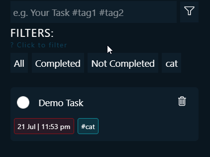
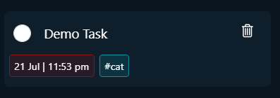
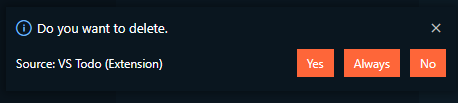

# VS Todo

## Now don't have to worry about your issue with remembering just add and check. :blush

### With V2 Now become more productive more organized with the brand new filter options and many more feature. 
___
## Features

- **ADDING TASK**
    - Easy to add via clicking **add task** button on activity bar.
    - just select a text and press <kbd>Ctrl + Alt + a</kbd> or <kbd>shift+cmd+a</kbd> to add to todo list.
    - Without any selection press <kbd>Ctrl + Alt + a</kbd> or <kbd>shift+cmd+a</kbd> to open a input pop up.
- **MANAGING**
    - Type Task name following by tag name with a prefix of # to add organized with tag
    - no limit for tag you can add as much as you want
    - Filter: Multiple filter present for better productivity (Press on the filter icon).
    - task now contain category name in cyan color and creation time in red color for better management.
    - completed and incomplete task on the status bar left side.
-   **EASE OF USE**
    - Press <kbd>Ctrl + k, ctrl + v</kbd> for windows and <kbd>cmd + k cmd + v</kbd> for mac  to open vstodo from anywhere.

<!-- &#9744  &#9745  -->

## Complete Tutorial
___

____

## Release Notes
___

### 0.0.1
Initial release of VS todo
### 0.0.2
minor bug fix.
### 1.0.0
Added shortcut key bindings.
### 1.1.0
Added shortcut to input pop up.
### 1.2.0
Added Category based task grouping.

### [2.0.0] - 22 July 2021

## Added
* Single task on multiple category
* Filter: Multiple filter present for better productivity
* task now contain category name in cyan color and creation time in red color for better management.
* completed and incomplete task on the status bar left side
* Keybindings to open panel: <kbd>Ctrl + k, ctrl + v</kbd> for windows and <kbd>cmd + k cmd + v</kbd> for mac.
* No more accidental delete.

## Changed
* Look : The UI is completely changed now more minimal but also detailing look.
## fixed
* No Task add until the panel open first time.

<!-- 

 -->

## **Enjoy!**